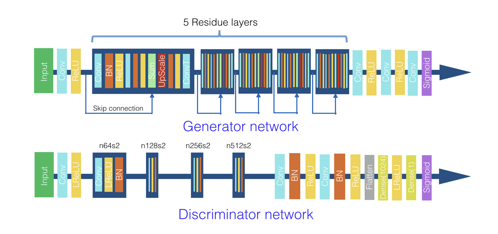

# DCGANs for image super-resolution, denoising and deblurring
Dan Sochirca, Petter Reijalt

In this blog post, we emulate the findings in the paper DCGANs for image super-resolution, denoising and deblurring [^1]. We sought to improve on the suggested architecture by introducing and leveraging self-attention. 

## Introduction
Increased computational power and the advent of bigger datasets have improved the ability of deep learning methods to do image processing. Generative adversarial networks (GANs) have been created to learn deep representations without needing extensively annotated training data. GANs can learn by implicitly figuring out the similarity between the distribution of a certain candidate model and the distribution of the real data. A so-called _generator_ tries to 'fool' the _discriminator_ by emulating a sample from the real data set. The _discriminator_ tries to differentiate between samples produced by the _generator_ and drawn from the real data distribution. Early GANs made use of fully connected neural networks for both the generator and the discriminator. This naturally evolved into convolutional GANs, as Convolutional Neural Networks (CCNs) are well suited to image data [^2]. This resulted in Deep Convolutional GANs (DCGANs), which use strided and fractionally strided convolutions. These DCGANs have been successfully used to build up good image representations [^3]. In this blog post, we leverage these capabilities in order to denoise images. 

## Background
### GANS
GANs be formulated as a minimax problem: 

$$\min_G \ \max_D {f(D,G) = nE_{e \sim P_{data(x)}}[log D(x)] + E_{z \sim P_z(z)}[log(1-D(G(z)))}$$

This means the discriminator must assign probabilities to input generated by real data $x$ and low probabilities to the generated data $G(z)$. The generator, however, needs to minimize $log(1-D(G(z)))$ [^4]. 

### DCGANS

### Denoising
#### Median filter
The median filter is non-linear filtering technique. A non-linear filtering alters only the pixels it deems to be corrupted. The median filter than replaces this corrupted pixel by the median value [^5]. 

#### Non-local means
Non-local means uses a weighted average of surrounding pixels in order to determine a pixels' supposed value. These weights are based on the similarity between the patches in which the pixels lie [^6].

## Methodology

## Results

## Conclusion

[^1]: [DCGANs for image super-resolution, denoising and debluring](https://stanford.edu/class/ee367/Winter2017/yan_wang_ee367_win17_report.pdf)
[^2]: [Generative Adversarial Networks: An Overview](https://ieeexplore.ieee.org/abstract/document/8253599)
[^3]: [Unsupervised Representation Learning with Deep Convolutional Generative Adversarial Networks](https://arxiv.org/abs/1511.06434)
[^4]: [Generative Adversarial Networks: Introduction and Outlook](https://ieeexplore.ieee.org/abstract/document/8039016)
[^5]: [Image Denoising using New Adaptive Based Median Filters](https://arxiv.org/abs/1410.2175)
[^6]: [Nonlocal Means-Based Speckle Filtering for Ultrasound Images](https://ieeexplore.ieee.org/stamp/stamp.jsp?tp=&arnumber=4982678)
